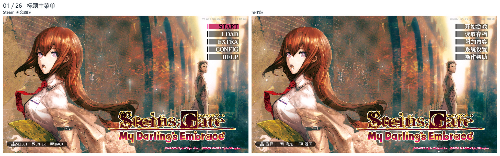
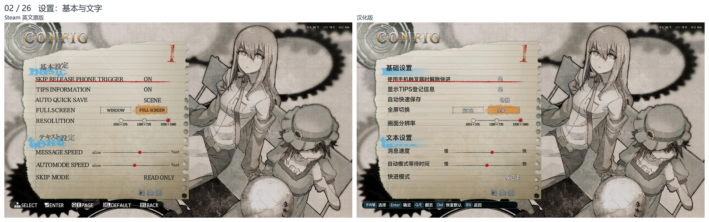
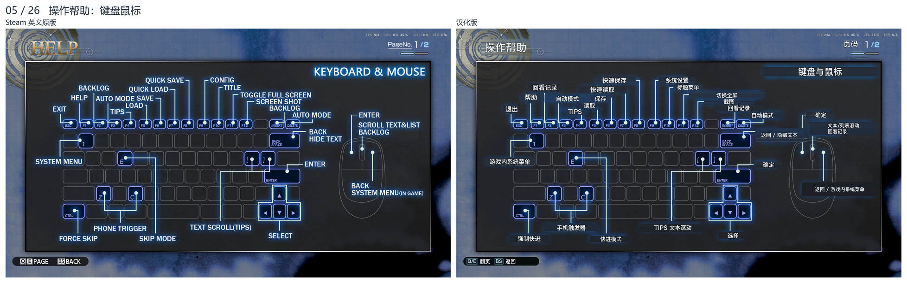
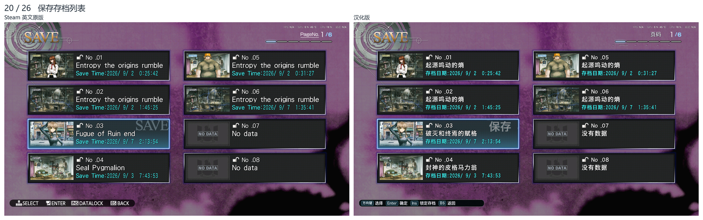
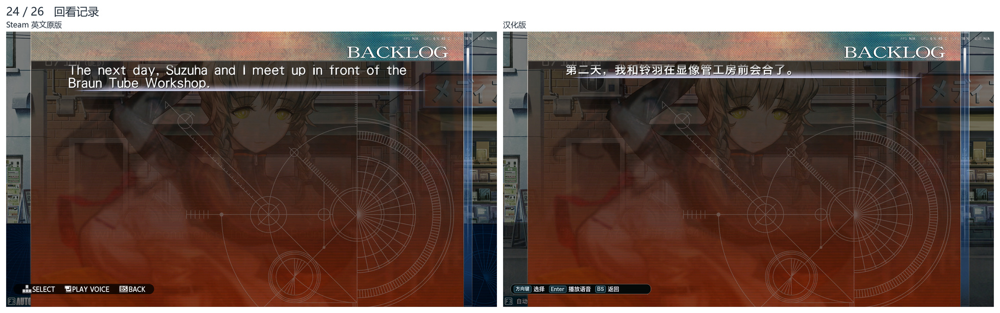
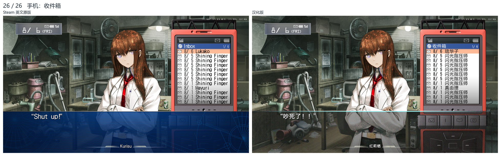

# STEINS;GATE: My Darling’s Embrace 汉化补丁

《命运石之门：比翼恋理的爱人》Steam **英文版**简体中文补丁，当前版本 **v1.2**。

**本项目基于并参考 [fengberd/MagesTools](https://github.com/fengberd/MagesTools) 的 EasyPatcher 与 MagesLib 修改而来。感谢 FENGberd 提供的 MAGES 引擎资源处理工具。** 这不是官方补丁，也不代表上游作者或游戏发行方。

## 功能

- 剧情、邮件、TIPS 等文本汉化。
- 标题、设置、存读档、系统菜单、手机与操作帮助本地化。
- 标题菜单保留原版底色、高亮、布局和装饰，仅汉化文字。
- 优化小型 UI 与正文的字重、描边和可读性。
- 优化过剧情时文本的UI。
- 修复 `Lab mem` 等英文词组的空格过宽问题，恢复原版英文词间距。

## 下载与安装

从 [v1.2 Release](https://github.com/1VeniVediVeci1/SG-MDE-Chinese-Patch/releases/latest) 下载 **`SG-MDE-Chinese-Patch-v1.2.zip`**。请下载这个完整安装包，而不是 GitHub 自动生成的 `Source code` 压缩包。

1. 在 Steam 中将游戏语言设为**英语**，等待更新完成，然后退出游戏。
2. 将补丁 ZIP **完整解压**到一个可写目录，保留 `EasyPatcher.exe`、两个 DLL、配置文件与 `berd` 文件夹的相对位置。
3. 运行 `EasyPatcher.exe`，选择游戏安装目录（该目录下应有 `USRDIR` 文件夹）。
4. 点击 **应用补丁**，等待成功提示，然后正常启动游戏。

运行环境：Windows，.NET Framework 4.5 或兼容的较新版本。不需要 Python、.NET SDK 或开发工具。

请先自行备份重要存档。补丁器会在游戏目录创建 `USRDIR.bak`，用于保留资源备份；**不要随意点击“删除备份”**。重复应用补丁时会使用该备份作为基线。

### 恢复原版

退出游戏后，用 `USRDIR.bak` 中的对应 MPK 文件覆盖回 `USRDIR`；也可在 Steam 中验证游戏文件完整性。若游戏已更新、备份来源不明或此前对日文版应用过补丁，建议先验证游戏文件，再重新应用。

## 原版与汉化版对比

左侧为 **Steam 英文原版**，右侧为 **汉化版**。图片来自真实游戏画面；不同采集时刻的选中态、动画和计时可能不同。点击图片可查看大图。

### 标题主菜单

### 设置

### 操作帮助

### 保存页面

### 回看记录

### 手机收件箱

**[查看完整 26 组对比图](docs/screenshots.md)**，涵盖标题、设置、帮助、鉴赏、TIPS、邮件、存读档、剧情、回看和手机页面。

## 源码与构建

- `src/EasyPatcher`：补丁器界面及应用逻辑。
- `src/MagesLib`：MPK / SCX 读取、修改与写入库，来源于 MagesTools。
- `berd`：本版本使用的文本与资源补丁数据。
- `fastJSON.dll`：JSON 依赖，与 MagesTools 随附版本一致。

构建方法见 **[源码构建说明](src/BUILD.md)**。

## 来源与致谢

- **[FENGberd / MagesTools](https://github.com/fengberd/MagesTools)**：本项目工具基础。EasyPatcher 和 MagesLib 并非本项目从零开发；原作者版权及 MIT 许可证见 [LICENSE](LICENSE)。
- **[Mehdi Gholam / fastJSON](https://github.com/mgholam/fastJSON)**：JSON 序列化库。
- 游戏画面、角色、美术、文本及相关商标的权利归各自权利方所有。代码许可证不授予这些内容或第三方字体的权利。

详细依赖来源见 [第三方声明](THIRD_PARTY_NOTICES.md)。
