# 原版与汉化版对比

左侧为 Steam 英文原版，右侧为汉化版。以下为实机截图，未改绘游戏画面；仅拼接、添加栏标题并缩放为适合浏览的尺寸。游戏画面版权归原权利方所有。

## 标题主菜单

保留原版背景、Logo与菜单布局；中文菜单为加粗宋体。左侧START选中、右侧未选中，为采集状态差异。

## 设置：基本与文字

同一基本/文字设置页；原版灰色齿轮与人物背景保留，标签汉化；本次未改动设置值。

## 设置：音量

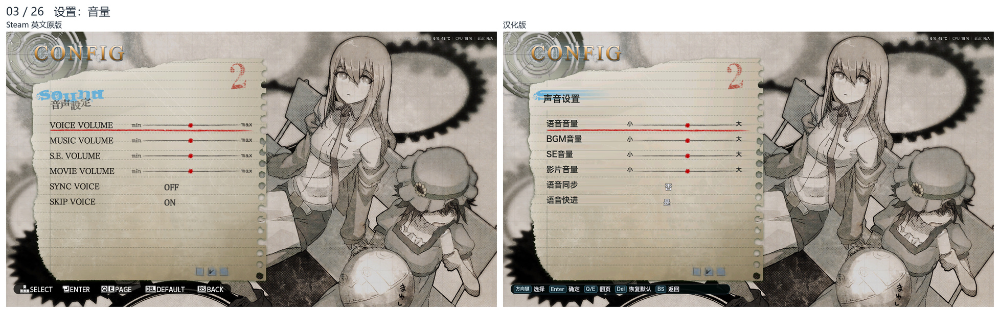

同一音量设置页；原版灰色背景与布局保留，标签汉化；本次未改动设置值。

## 设置：角色语音

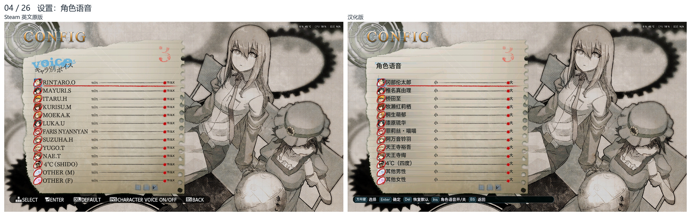

同一角色语音设置页；原版灰色背景与布局保留，角色标签汉化；本次未改动设置值。

## 操作帮助：键盘鼠标

同一键鼠帮助页；保留原图示，中文说明与标注有本地化排版差异。

## 操作帮助：手柄

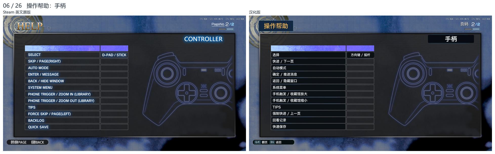

同一手柄帮助页；按实际显示保留图示及按键栏，不补画源截图没有的内容。

## 附加内容菜单

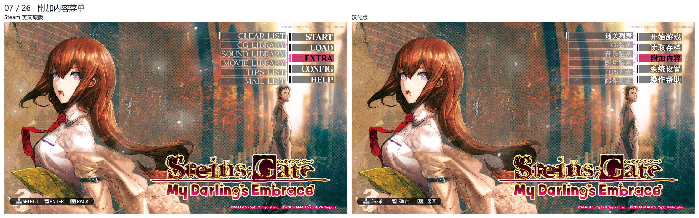

同一附加内容子菜单；保留原版背景、底条和高亮，菜单文字汉化。

## 通关列表

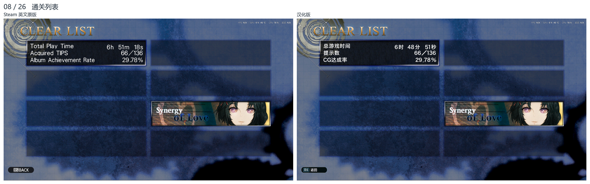

同一通关列表与解锁状态；总游戏时间因采集时刻不同而有差异，英文章节插图保留。

## CG鉴赏

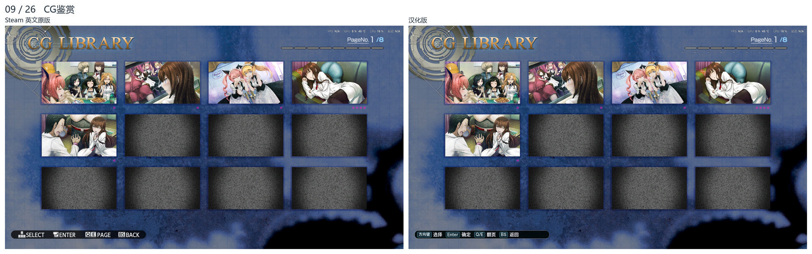

同一CG列表第1/8页；缩略图、背景保留，底部操作提示汉化。

## 音乐鉴赏

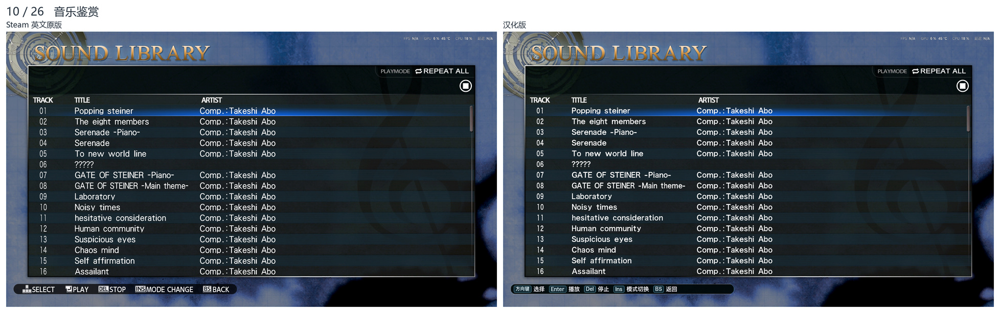

同一音乐列表与首曲；曲名、作者维持英文，底部操作说明汉化。

## 影片鉴赏

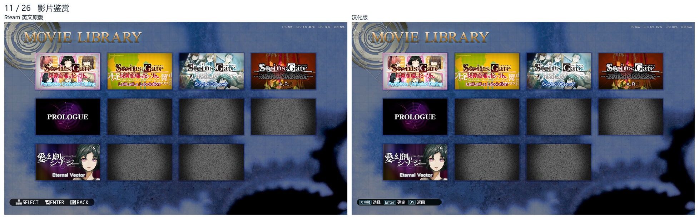

同一影片鉴赏列表；原版封面与背景保留，底部操作说明汉化。

## TIPS分类与词条

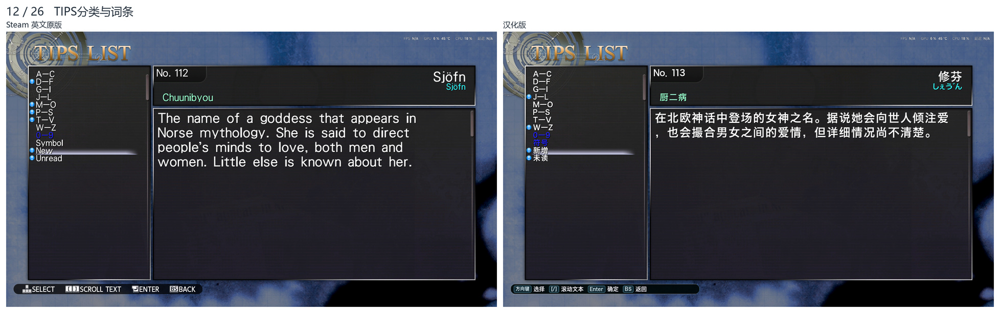

同一Sjöfn/修芬释义；原版编号112、汉化113，为既有编号差异；正文已去除额外描边。

## TIPS展开列表

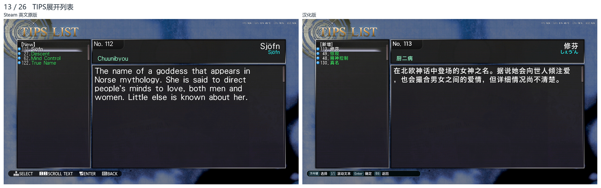

同一Sjöfn/修芬词条及展开列表；原版112、汉化113，为既有编号差异；正文已去除额外描边。

## 邮件列表

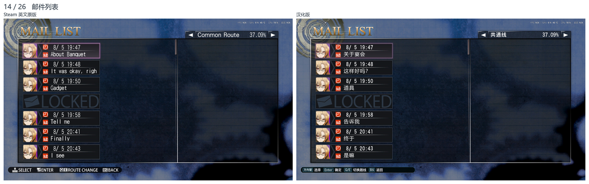

同一共通线邮件列表，选中8/5 19:47宴会邮件；中文主题与发件人采用常规笔画。

## 邮件详情

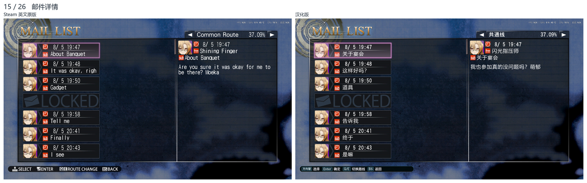

同一封宴会邮件正文；最新中文为常规字重、无额外描边，背景与布局保留。

## 读取方式子菜单

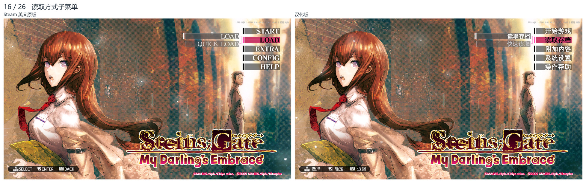

同一读取方式子菜单；原版底条与高亮保留，普通读取/快速读取文字汉化。

## 读取存档列表

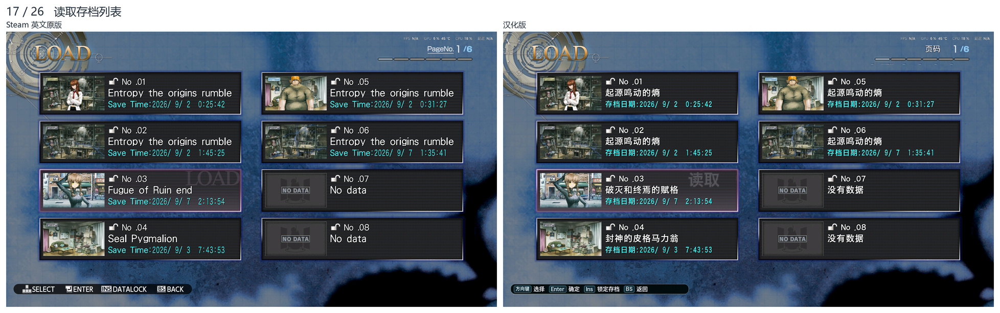

同一第1/6页No.03槽位；保留原版蓝色背景及NO DATA图，其他标签与提示汉化。

## 读取确认对话框

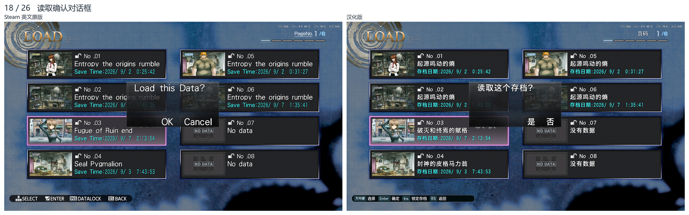

同一No.03读取确认；窗口内容汉化，背景与槽位保持对应。

## 剧情旁白

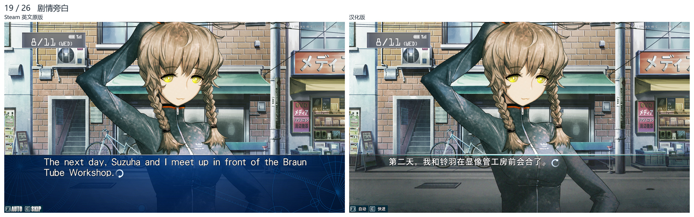

同一No.03旁白；剧情框沿用既有汉化样式，原字体字号保留并去除额外烘焙描边。

## 保存存档列表

同一第1/6页No.03槽位；保留原版紫粉色背景及NO DATA图，其他标签与提示汉化。

## 快速读取列表

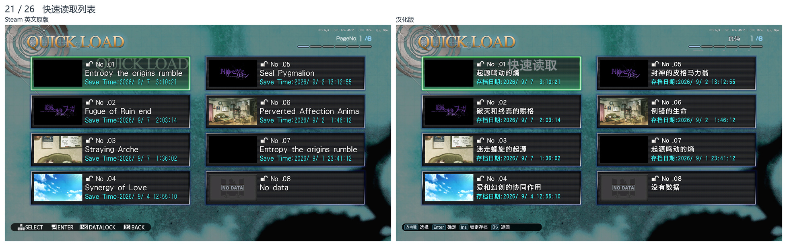

同一第1/6页No.01槽位；保留原版青绿色背景及NO DATA图，其他标签与提示汉化。

## 剧情内系统菜单

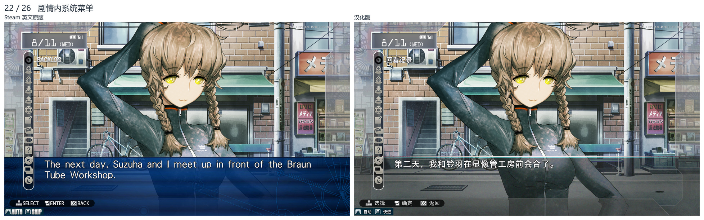

同一No.03旁白下的剧情系统菜单；原场景与侧边布局保留，操作文字汉化。

## 角色对白

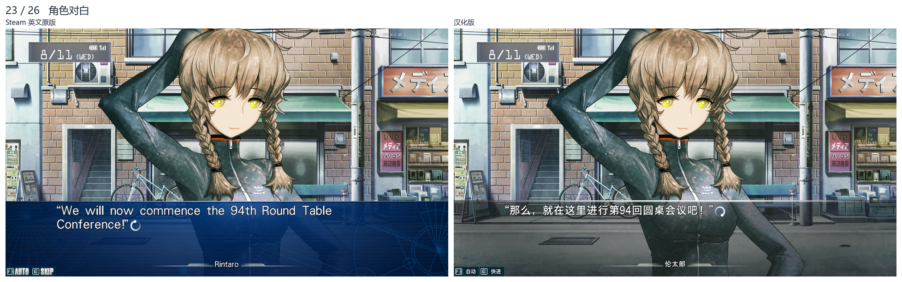

同一第94次圆桌会议对白；人物/姓名装饰保留，剧情框为既有汉化UI样式。

## 回看记录

同一前句回看记录；原版橙色齿轮背景保留，最新中文正文去除额外描边。

## 手机：收到邮件

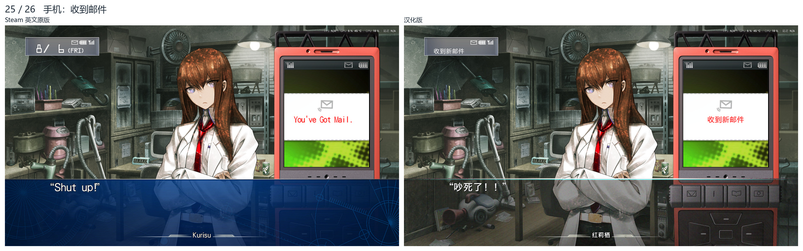

同一共通线对白和新邮件提示；手机本体未改，中文提示无额外描边；顶部通知轮播时点不同。

## 手机：收件箱

同一收件箱第1/6页；手机本体未改，中文标题/列表为常规字重，无白色描边。
